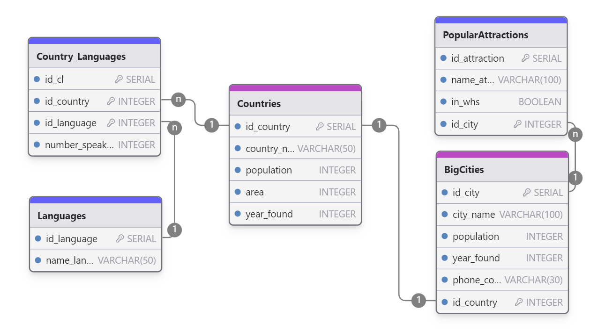

### Main Description
The project is a relational database designed to store information about North American countries, their major cities, landmarks, and languages. The data model consists of 5 tables with implemented one-to-many and many-to-many relationships, the latter achieved through a junction table.
#

